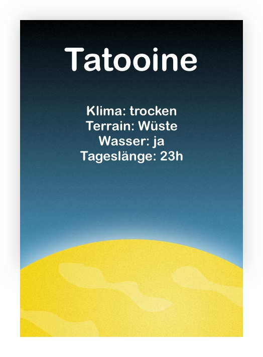

# Wetterbericht für Star Wars Planeten

## Story

Als Weltraumpilot möchte ich Wetter-Informationen für die Planeten bekommen, 
damit ich die richtigen Sachen einpacken kann wenn ich durch die Galaxis reise.

### Akzeptanzkriterien

Gegeben ist ein Reisender der nach Tattooine reisen möchte. 

* Wenn der Reisende seinen Koffer für die Reise packt, sollen folgende Informationen für den Planeten Tattoine verfügbar sein: 

  * Welches Klima hat der Planet?
  * Welches Terrain hat der Planet?
  * Gibt es Wasser?
  * Wie lang ist ein Tag?

## Design 

## Aufgabenstellung

Bitte erstellt ein einem eigenen Branch jeder eine Angular App.

Die Daten sollen aus der Api kommen: 

* https://swapi.dev/

### Hilfestellung

1. Git clonen: https://git.dser.local/learning/the-weather und eigenen Branch erstellen
2. Angular Projekt erstellen: https://angular.io/guide/setup-local
3. Api Dokumentation nach den Informationen durchsuchen
4. Service erstellen in Angular und Api abrufen
5. Daten in Komponenten anzeigen
6. Tests erstellen
7. Design-Vorgabe mit CSS umsetzen
8. Änderungen im GIT speichern (commit, push)